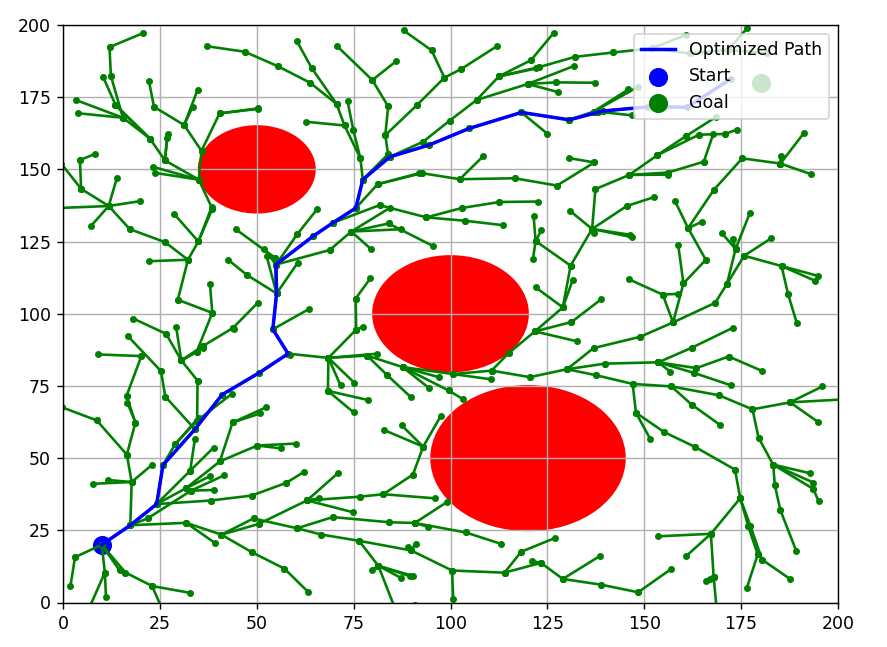
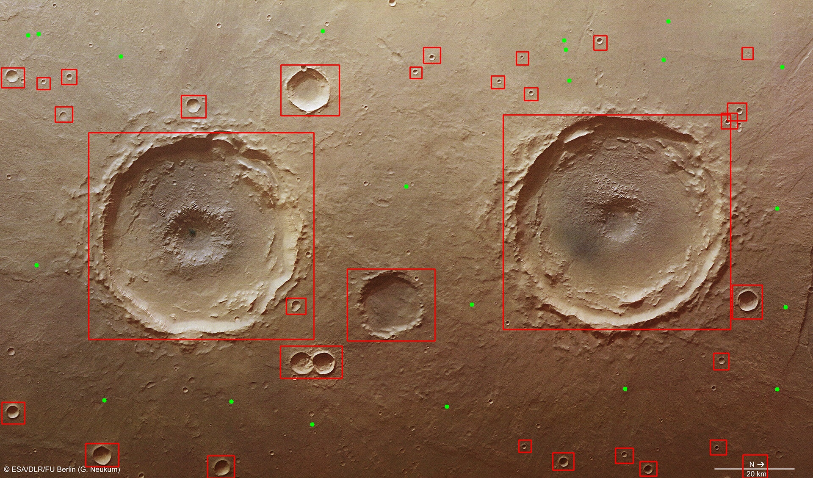
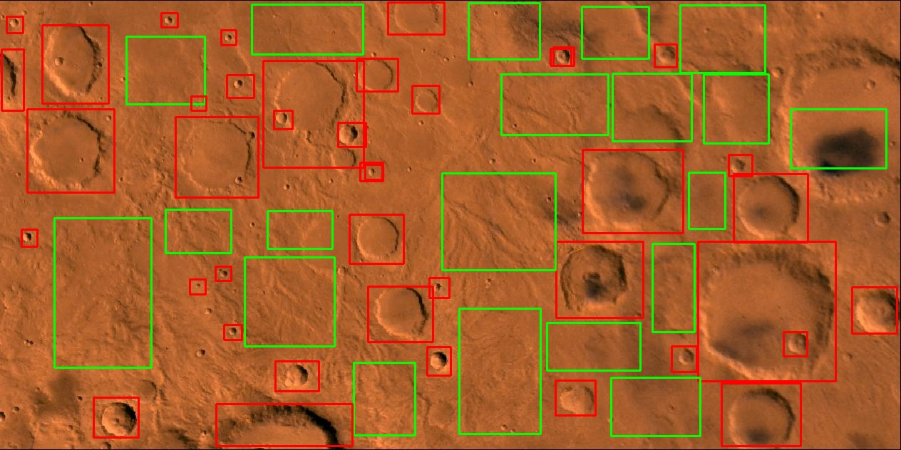

# 🚁 ISRO Robotics Challenge (Autonomous Quadcopter)

> An experimental autonomy toolkit for vision-assisted navigation, state estimation, and collision-aware path planning.

This repository brings together software prototypes developed for an autonomous quadcopter workflow: terrain perception, Kalman-filter state estimation, and RRT/RRT* motion planning. It serves as a practical foundation for GPS-denied aerial robotics research and simulation.

---

## 📌 Overview

The project is organized around four cooperating capabilities that a GPS-denied drone would need: seeing terrain features (perception), estimating its own position despite noisy sensors (estimation), planning a safe route around obstacles (planning), and reacting visually to stay stabilized (control). Each capability is implemented as an independent, runnable prototype rather than a single integrated flight stack.

---

## ✨ Highlights

- **Terrain perception**: OpenCV Hough-Circle crater detection, plus a YOLOv8 model trained to distinguish craters from safe landing spots
- **State estimation**: a 2D Kalman filter prototype for smoothing noisy position measurements
- **Path planning**: RRT* implementations (standalone, and combined with Kalman-filtered position estimates)
- **Flight-control prototype**: webcam-based visual feedback and proportional-control experiment
- **Training data**: a labelled 2-class terrain-image dataset (`craters`, `safespots`) under `data/yolo/`

---

## 🖼️ Results

### 🌳 RRT* Path Planning
Optimized path generated through a randomly sampled tree, navigating around circular obstacles from start to goal.



### 🪐 Crater Detection
Craters and terrain hazards identified and bounded on a real planetary-surface image.



### 🎯 Path Planning to a Safe Spot
Live detection run showing craters (red) and safe landing spots (green) identified on a terrain image, with an estimated path traced toward a safe zone.


### 🟥🟩 Crater & Safe-Spot Detection
Combined detection output distinguishing hazardous crater regions (red) from viable safe-landing regions (green) across a terrain image.



---

## 📂 Project Structure

```text
ISRO-robotics-2025/
├── assets/
│   ├── results/
│   │   ├── crater-detection.jpg
│   │   └── landing-zone-detection.jpg
│   └── sample_maps/
│       ├── mar3.jpg
│       └── mar8.jpg
├── data/
│   ├── archives/                               # older/backup dataset versions (update if this serves another purpose)
│   └── yolo/
│       ├── dataset/                             # additional YOLO working data (incl. path_result.jpg)
│       ├── images/train/
│       ├── labels/train/
│       └── data.yaml                            # 2-class YOLO config: craters, safespots
├── src/
│   ├── flight_control/
│   │   └── visual_odometry.py
│   ├── path_planning_navigation/
│   │   ├── RRT_STAR.py
│   │   ├── Kalman_RRTSTAR.py
│   │   ├── RRT_Path_Planning.png                # result image, co-located with the script
│   │   └── Path_Planning_with_Safe_Spot.png     # result image, co-located with the script
│   ├── state_estimation/
│   │   └── kalman_filter_demo.py
│   └── terrain_perception/
│       ├── crater_detection.py
│       ├── Creator_Detection.png                # ⚠️ typo — rename to Crater_Detection.png
│       └── Creator_and_Safespot_Detection.png   # ⚠️ typo — rename to Crater_and_Safespot_Detection.png
├── .gitignore
└── requirements.txt
```

---

## 🛠️ Tech Stack

| Layer | Technology |
|---|---|
| Computer vision | OpenCV (`cv2`) |
| Object detection | Ultralytics YOLOv8 |
| Numerical computing | NumPy |
| Plotting/visualization | Matplotlib |
| Language | Python 3.9+ |

---

Run an experiment from the repository root:

```bash
python src/path_planning_navigation/RRT_STAR.py
python src/state_estimation/kalman_filter_demo.py
python src/terrain_perception/crater_detection.py
python src/path_planning_navigation/Kalman_RRTSTAR.py
python src/flight_control/visual_odometry.py
```

> Some demos open an OpenCV or Matplotlib window. The visual-odometry prototype additionally requires an accessible webcam.

---

## 🧩 Components

| Area | Entry point | Purpose |
| --- | --- | --- |
| Path planning | `src/path_planning_navigation/RRT_STAR.py` | Demonstrates RRT* route generation around circular obstacles, with parent re-selection and rewiring for path optimization. |
| Sensor fusion | `src/state_estimation/kalman_filter_demo.py` | A 2D constant-velocity Kalman filter that smooths simulated noisy position measurements. |
| Integrated planning | `src/path_planning_navigation/Kalman_RRTSTAR.py` | Combines Kalman-filtered position estimates with RRT* planning over a grayscale terrain map image. |
| Terrain perception | `src/terrain_perception/crater_detection.py` | Detects circular crater-like terrain features using Gaussian blur, morphological opening, Canny edges, and Hough Circle Transform. |
| Flight control | `src/flight_control/visual_odometry.py` | Uses live webcam contour detection and a proportional controller to compute stabilization corrections relative to frame center. |
| Crater/safe-spot detection *(script location TBD)* | — | A YOLOv8 model trained on `data/yolo/data.yaml` (`craters`, `safespots`) — responsible for the bounding-box detections and the "Path to Safe Spot" app seen in the Results section above. |

---

## 🗂️ Dataset

`data/yolo/` contains terrain images, annotation labels, and `data.yaml`, defining a 2-class detection task:

```yaml
path: .
train: images/train
val: images/train

names:
  0: craters
  1: safespots
```

Generated training runs, checkpoints, caches, and inference outputs are deliberately excluded from version control to keep the repository lightweight.

---

## 🚧 Status

This is an experimental academic robotics project. Individual scripts are standalone prototypes and may require parameter tuning for a specific map, camera, or flight platform.

---

## 📄 License

This project is open-source. Feel free to use, modify, and distribute it as per your needs (add your preferred license, e.g. MIT, here).

---

## 🙌 Acknowledgements

- Built using [OpenCV](https://opencv.org/) for perception and control, and [Ultralytics YOLOv8](https://github.com/ultralytics/ultralytics) for crater/safe-spot detection.
- Path planning based on the RRT/RRT* family of sampling-based motion planners.
- State estimation based on the classical discrete Kalman filter.
